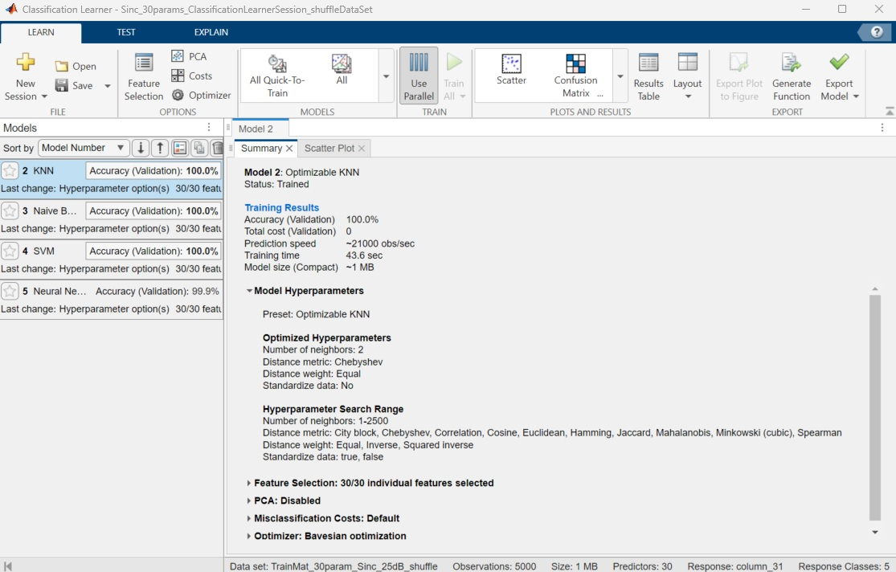
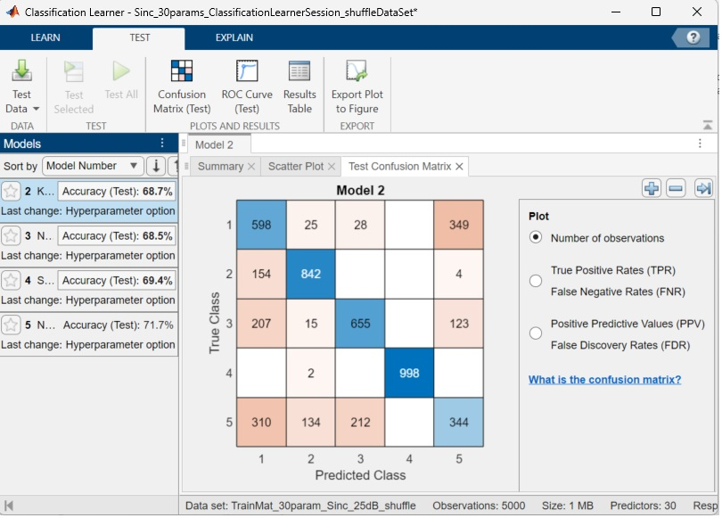
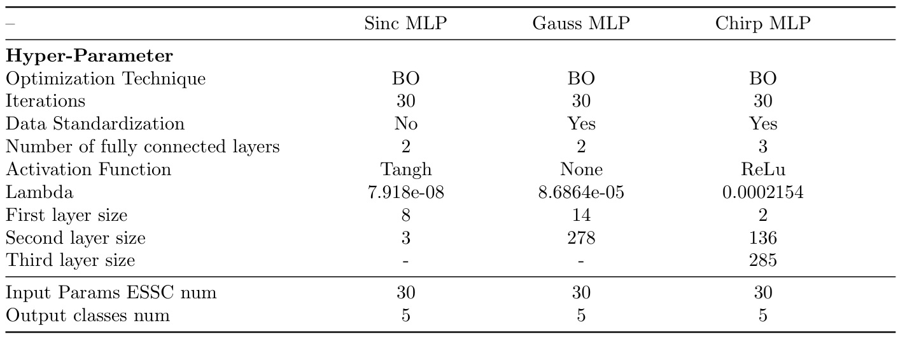
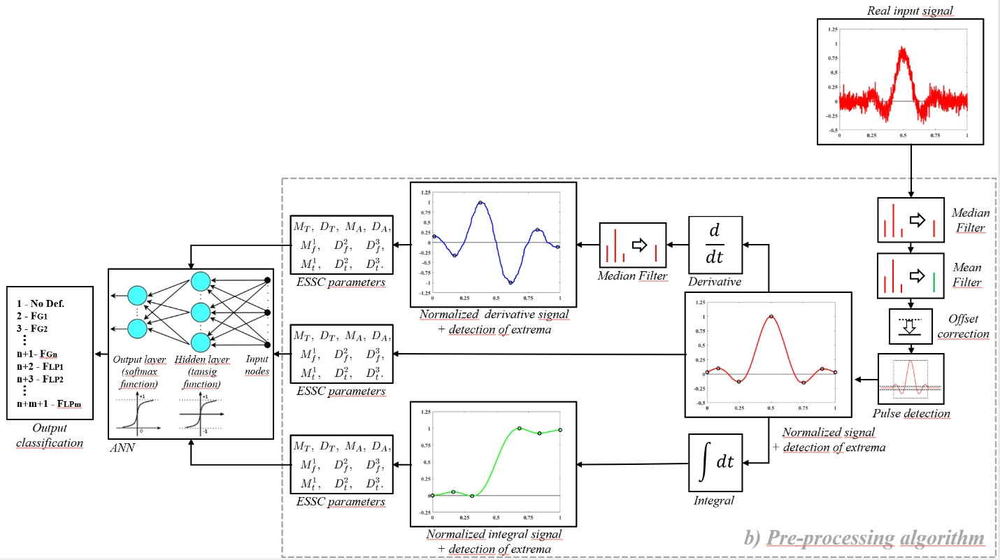

# ML-Classification-JournalSubmiss
This project contains Machine Learning trained files used in the research work "Extended method for Statistical Signal Characterization using moments
and cumulants: Application to recognition of pattern alterations in pulse-like waveforms employing Artificial Neural Networks". 
- DataSets.
- Classification Learner session files.
- Matlab scripts.
- Trained Machine Learning models.
- Plots

## Classification Learner: Sessions and DataSets

The datasets were generated and formatted using the [Pulsed-LikeSignal-Generator](https://github.com/ghernanbustos/Pulsed-LikeSignal-Generator.git).  
They were then imported into this repository and randomized using the script `shuffleDataBaseGen_<signalName>.m`.  
This process produces three training datasets for Sinc, Gauss and Chirp signal encapsulated in the files named `<signalName>_workspace.mat`.

The MATLAB Classification Learner Toolbox was used to train and evaluate various artificial neural network (ANN) models.

### How to Reproduce the Workflow

1. **Load the workspace file**  
   Open MATLAB and load the respective `<signalName>_workspace.mat` signal file.

2. **Launch the Classification Learner Toolbox**  
   Open the toolbox and load the corresponding session file from the workspace.  
   For example:  
   `Sinc_30params_ClassificationLearnerSession_shuffleDataSet.mat`  
   (for the Sinc signal with 30 parameters)

3. **Explore trained models**  
   All trained models will be listed and ready for evaluation.  
   Model parameters are visible as shown in the figure.

4. **Test with alternate datasets**  
   Navigate to the **Test** tab in the toolbox and load a different dataset to evaluate each trained model.  
   This step is also illustrated in the figure.

5. **Repeat for each signal**  
   Use the appropriate session file for each signal and parameter configuration (e.g., 30 or 4 parameters).

<figure>
  

  
  

</figure>

	Trained model parameters.

<figure>
  

  
  

</figure>

	Confusion Matrix test with 25dB SNR data test.

<figure>
  

  
  

</figure>

	Model params calibrated for Sinc, Gauss and Chirp signal trained with 30 ESSC dataset at 25dB SNR.

## Measuring Algorithm Execution Time

To measure execution time, load the following files into the MATLAB workspace:

- `<signal-type>_<filter-deformation-type>_25dB_testElement.mat` — raw signal data  
- `<signal-type>_exportedTrainedModels.mat` — trained ANN models

The first `.mat` file contains the raw signal with filter deformation. It loads two 1×1024 arrays: 
one for amplitude and one for time. This raw signal is required to evaluate the execution time of 
the **ESSC feature extraction + ANN classification** pipeline (see figure schema).

<figure>
  

  
  

</figure>

	Real Signal with filters, ESSC extraction algorithm and ANN classifier schema.

Finally, first run the script `timeMeasure_<signal-type>.m` and then `plot_algorithm_time.m` 
to calculate and plot ML computation time, where each processing time
value represents the average of 100 algorithm executions.

## Ranking Features

To rank execution time and feature relevance, load and execute the following files:

Inside the folder `<signal-type>_ann_manually`, the ANN model is manually constructed using the script `dL_manually.m`.  
This script uses weights and biases obtained during the training process, with classification learner, 
and evaluates the model by generating a confusion matrix for each dataset (25 dB, 20 dB, 15 dB, etc.).

It loads the following components:
- `chirp_dataSets.m` — signal datasets  
- `chirp_mlp_clearner_model` — manually defined MLP model

To rank features using the RelieFF algorithm, run the script:

- `rankFeaturesV1_2.m`

## File Table List:

| Folder / File              				|              Description			      |
|-------------------------------------------------------|-----------------------------------------------------|
| `<signal>_<num_params>params_ClassificationLearnerSession_shuffleDataSet.mat`	|Classification Learner Session File (4 and 30 params)|
| `<signal>_workspace.mat`							| Formated Datasets to be used in Classification Learner|
| `<signal>_exportedTrainedModels.mat`						| Exported Object model file     |
| `<signal>_<filter-deformation>_25dB_testElement`				| Raw Signal data used to measure ESSC extraction feature + ANN classification execution time|	
|`<signal-type>_timeModelMat`							|model average execution time|
|Folder `<signal-type>_ann_manually`						|Files to build model manually and Rank features |

	Table: Files used in project.

## Author

- Guillermo H. Bustos 	(ghernanbustos@gmail.com)
- Héctor H. Segnorile 	(segnoh@gmail.com)
- **Institution**: Instituto de Física Enrique Gaviola (IFEG CONICET)- Universidad Nacional de Córdoba - FAMAF

